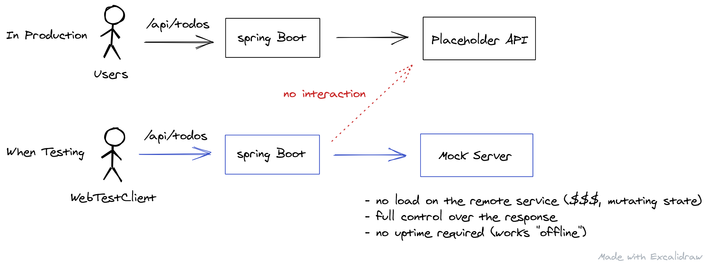

# Codebase for the blog post [Spring Boot Integration Tests with WireMock and JUnit 5](https://rieckpil.de/spring-boot-integration-tests-with-wiremock-and-junit-5/)



Steps to run this project:

1. Clone this Git repository
2. Navigate to the folder `spring-boot-integration-tests-wiremock`
3. Run `mvn verify` to execute the integration tests on your machine 
4. (Optional) Run `mvn verify -Dit.test=ManualSetupIT#basicWireMockExample` to execute a single integration test
5. (Optional) To start the application, execute `mvn spring-boot:run` and access http://localhost:8080/api/todos


Code coverage avec jacoco :
https://softwareengineer.medium.com/code-coverage-in-sonarqube-for-maven-projects-56f7a1a4d496

Sonarqube docker :
https://www.bitslovers.com/how-to-use-sonarqube-with-docker-and-maven/


````sh
colima start --arch x86_64
docker-compose up
````

Ouvrir sonarque : http://localhost:9000

login/mdp : admin/admin
changer pour : sonar/sonar

En haut à droite cliquer sur le 'A' > My Account > Security

Puis créer un token
New token "sb-wiremock-it" has been created. Make sure you copy it now, you won't be able to see it again!
ef22790ed79fd8a6f7d309f6f3c2f2592f083447
